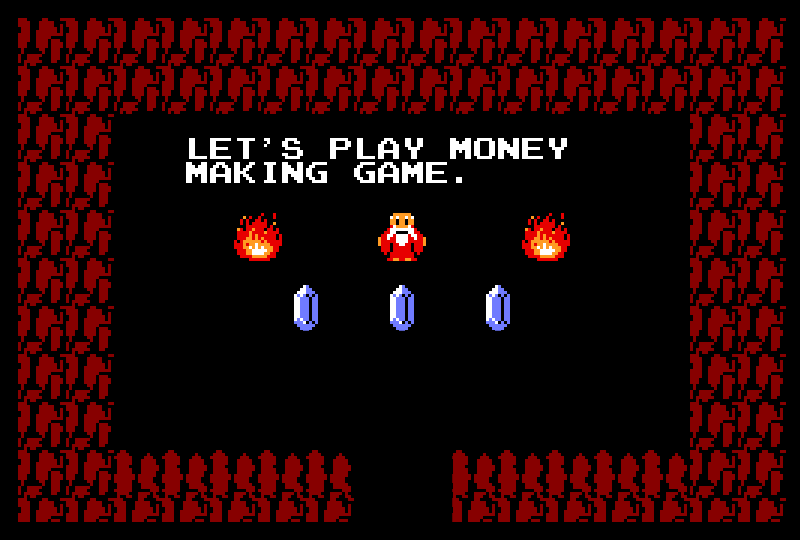

# ATT-Core

<p align="center">
	
</p>

# ATT Money

 ATT  money is an experimental protocol. It is  elastic supply token with negative rebases (only when price deflates below US$1). The total supply of  ATT  is not fixed and also does not adjusts on a regular basis. These supply adjustments, called "rebases", are done in such a way that users’ proportional holdings don’t change and thus aren’t diluted. Rebases are performed to achieve a specific target base price, with the idea being that a token’s base price is always maintained i.e, US$1 or above. 
 
 
- Interface: [att.money](https://att.money/)
- Docs: [medium: att.money](https://medium.com/@attmoney/)
- Twitter: [@att_money](https://twitter.com/att_money)
- Email: [devs@att.money](mailto:devs@att.money)
 
 
# Deployment

```
1. ATT Token : 0xc667dd95f5f3a2919dfc4c80c68753c0c6accbd0
	bscscan link : https://bscscan.com/address/0xc667dd95f5f3a2919dfc4c80c68753c0c6accbd0
```

# Architecture

The  ATT  project is a direct fork of DITTO (some major inspiration from Ampleforth & Anti-Ample is also taken) with possibilities for positive rebases removed because we are not trying to be equivalent to FIAT. There are plenty of USD equivalent options out their and all doing pretty well. ATT base price is set to $1 but does not have an upper price ceiling. Base price programmed to reset to above $1 on the basis of 30 days average price executed by community via a governance proposal.

It includes code from other cutting-edge elastic supply projects and several novel ideas. The original architecture has been simplified into two main contracts:
    
    1.  ATT  Token - ERC20 token that implements the (Negative) rebase function.
    2.  ATT  Master - Contains the rebase configuration and admin functionality.
    
The third necessary component is the price Oracle. The MarketOracle smart contract provides the functionality for calculating an average price using the Uniswap TWAP Oracle interface.

# Configuration

Important rebase parameters are found in the master contract. Most of these values are set during construction or directly in the code.

    • deviationThreshold: If the current exchange rate is within this fractional distance from the target price, no supply update is performed. By default this is set to 0.05.
    • rebaseCooldown: Minimum time that must pass between rebases, in seconds. The default value is 4 hours.


### Variable rebase lag
Supply adjustments in  ATT  are calculated as:
```
(_totalSupply * DeviationFromTargetRate) / rebaseLag
```

The rebaseLag is meant to "soften" the effect of the rebase. In  ATT  money, rebaseLag is set to specific values as the rebased provisioned are negative only. The default values are:
   
   • Negative rebase lag: 2
    
# Notifying pools of supply changes

Most of the time, liquidity and lending pools need to be notified of rebases so that the internal accounting is updated accordingly. This needs to happen atomically in the same transaction as the rebase. If this is not done correctly, attackers can take advantage of the internal accounting mismatch to steal value from liquidity providers.

The Master contract maintains a list of external function calls that are executed at the end of every rebase. The appropriate calls must be added by the contract owner whenever a new  ATT  liquidity pool is created (e.g., call sync() in an Uniswap liquidity pool). Use addTransaction(address destination, bytes calldata data) to add a call to the list.

# Initial distribution lock

Transferring  ATT Tokens is initially restricted to the owner. This is to allow an orderly distribution via airdrops, token sale, etc., while preventing users from listing  ATT  on AMMs ahead of the  ATT  team. Once the distribution lock has been released by the contract creator it cannot be re-engaged.

# Oracle deployment

The market oracle must be deployed last after the token has been listed on an AMM and has sufficient liquidity. To get going, a simple getter/setter Oracle can be used where the owner sets prices manually. The Oracle is switched for the market oracle once it has been tested and confirmed to be reliable.

The oracle calculates a rate for  ATT /USD based on a  ATT /BNB and BNB/USD pool, where "USD" is some kind of USD stable coin that must have high liquidity. On Binance Smart Chain, BUSD pools are most suited for this purpose.

# Attributions

1. The project is inspired by Ampleforth https://github.com/ampleforth/ & https://www.antiample.org/

2. Project was forked from https://github.com/Ditto-money

# License

[GNU General Public License v3.0 (c) 2021 att.money](./LICENSE)
